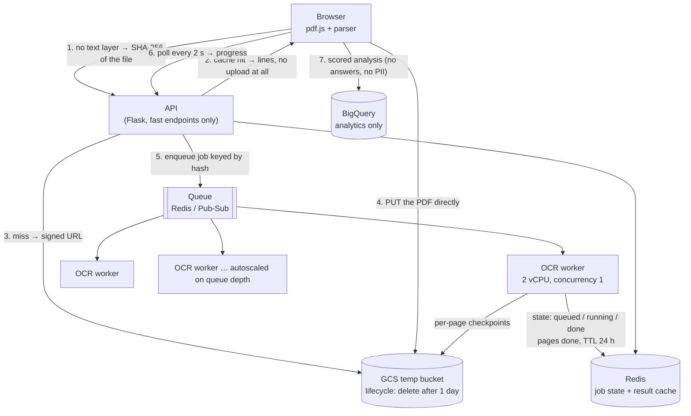

# Scanned-sheet OCR at scale

How the Answer Key Checker reads image-only PDFs, what it costs, and what has to
change to serve **100-page papers to 150+ candidates at once** on results day.

Written against measurements, not estimates — the numbers below were taken from
the 37-page OSSSC Pharmacist scan (6.8 MB, every page a picture) that exposed the
problem.

---

## 1. What actually happens today

```
browser: pdf.js reads the PDF's text layer
   ├── text found  ─────────────────────────────►  parsed in the browser, no server involved
   └── nothing to read (every page is an image)
            │
            └─►  POST /api/tools/answerkey-checker/ocr   (the whole file, multipart)
                     backend rasterises each page at 200 dpi and runs Tesseract
                     returns the recovered lines  ──►  parsed in the browser
```

Only the second path costs anything, and only some papers take it. A PDF that
carries its own text is read entirely in the browser and never touches the
backend — that fast path is not part of the problem and must stay.

### The failure this replaced

Pages were OCR'd one at a time in a single request. Measured against production:

```
$ curl -X POST https://tools-api.adda247.com/api/tools/answerkey-checker/ocr \
       -F "file=@OSSSC Pharmacist & MPHW 1st Shift 3-Aug-2024 Paper (2).pdf"
HTTP 504  time 84.8s
```

The gateway cut the request at ~85 s. The browser's `keyCheckOcr` turned that
into `null`, the upload reported nothing, and pressing **Analyze** asked the
candidate for the answers the OCR had been in the middle of recovering
("Add your responses — upload a response sheet or paste them above"). The file
was fine and the parser was fine; the transport was the failure.

### The current shape (shipped)

- Pages are OCR'd **concurrently**, bounded by the CPUs the container is actually
  allowed (`sched_getaffinity`, capped at 4).
- Each request OCRs for a **time budget** (`OMR_OCR_BUDGET`, 35 s) and then
  returns `nextPage`; the browser re-posts the file from there until `nextPage`
  is null.
- Verified: instalments produce byte-identical output to a single pass
  (1101 lines → 99 responses + 100 key answers, either way).

That removes the 504. It does **not** scale to 150 concurrent users, because
each instalment re-uploads the file and every page is still OCR'd per candidate.

---

## 2. The cost, measured

| | |
|---|---|
| Rasterise one page at 200 dpi (PyMuPDF) | 0.10 s |
| Tesseract `--psm 6` on that page | 0.50 s |
| **Total, developer machine (Apple silicon)** | **~0.6 core-seconds / page** |
| **Total, production shared vCPU (inferred from the 504)** | **~2 core-seconds / page** |

**200 dpi is not negotiable.** At 150 dpi the same paper is 17 % faster and loses
question 71 completely — both its key and the candidate's answer. A score that is
silently one question short is worse than a slower read.

### The arithmetic that decides the architecture

Per 100-page upload: **~200 core-seconds** of CPU in production.

| Concurrent uploads | CPU-seconds needed | Time to drain on 4 vCPU | on 32 vCPU |
|---|---|---|---|
| 1 | 200 | 50 s | 6 s |
| 20 | 4 000 | 17 min | 2 min |
| **150** | **30 000** | **2 h 5 min** | **16 min** |

No amount of queueing or clever transport changes that total. There are exactly
three levers, and the design uses all three:

- **A — don't do the work twice.** Cache OCR text by file content hash.
- **B — move the work off the server.** OCR in the browser (WASM).
- **C — buy CPU elastically.** A job queue with autoscaling workers.

---

## 3. Target architecture



### Why each piece is what it is

**Content hash as the job key.** `crypto.subtle.digest("SHA-256", bytes)` in the
browser, before anything is uploaded. On results day most uploads are the *same
few circulated PDFs* — the same paper, downloaded by thousands of candidates. The
first one pays for the OCR; everyone else gets the text back without uploading a
byte. It is also a free idempotency key: 150 simultaneous uploads of one paper
coalesce onto **one** job rather than 150.

It has a useful privacy property too. The only way to fetch cached text is to
present the hash, which means possessing the identical file. The cache cannot be
enumerated or browsed.

Per-candidate response sheets are unique, so they always miss the cache — that is
correct and expected. The cache is what stops the *shared* papers from being
re-read 150 times.

**GCS for the file, Redis for the state, neither for long.** The PDF is deleted as
soon as OCR finishes; only the recovered text is kept, under a 24 h TTL, and a
bucket lifecycle rule sweeps anything the code failed to delete. These sheets
carry names and roll numbers — nothing here is a durable store, and the lines are
never logged.

**BigQuery is not the job store.** It is the wrong tool for this and would fail in
a specific way: rows in the streaming buffer cannot be updated, so per-page
progress ticks are impossible; single-row lookups cost a query slot and hundreds
of milliseconds; and 150 users polling every 2 s would be tens of thousands of
queries. BigQuery keeps the job it already has — one row per completed analysis
(score, exam, paper, cohort), which is what the rank feature reads. Job state
belongs in Redis; the OCR text belongs in GCS/Redis.

**Workers separate from the API.** OCR is CPU-bound and bursty; the API is neither.
Together, one 100-page upload starves every other request on that instance. Split
apart, the API stays on a small fixed deployment and the OCR pool scales 4 → 32
vCPU on queue depth, then back to near zero between exams.

**Per-page checkpoints.** Each finished page's text is written as it is produced.
A worker that dies at page 87 resumes at 87, not at 1. Combined with an
at-least-once queue this makes worker eviction a non-event, which matters because
autoscaled, preemptible workers are exactly what makes this affordable.

**Polling, not sockets.** A 2 s poll against Redis is a few hundred microseconds
of work. WebSockets would need sticky sessions through the gateway for no gain.

### Sizing

Assume a peak of 150 concurrent uploads, 100 pages each, and — after the first
minute — a 60 % cache hit rate as the circulated copies warm up:

- 60 real jobs × 200 core-s = **12 000 core-seconds**
- 16 worker vCPU → drains in **12 min**; 32 vCPU → **6 min**
- Autoscale rule: target queue wait ≤ 5 min, so scale out at
  `queue_depth × 200s / vCPU > 300s`; cap the pool at a number your budget
  accepts, because the cap is what the honest wait time is computed from.

---

## 4. Failing safely

"Without a single failure" is not achievable and is the wrong target. The
achievable target is: **no silent wrong answers, and every failure is visible,
contained, and recoverable.** A candidate who is told "we could not read this,
paste your answers" is served. A candidate silently scored on 60 of their 100
questions is harmed.

| What breaks | What happens now | What it must do |
|---|---|---|
| One page OCRs badly | Its lines are lost; the paper looks short | Retry that page once; if it still fails, report `pages_failed` and name the missing question numbers in the UI |
| Worker crashes mid-job | Whole job restarts | Resume from the last per-page checkpoint |
| Queue backed up | Silent spinner | Honest "about N minutes" from real queue depth, plus the paste-manually option |
| Redis unavailable | — | Cache and state are advisory: degrade to the synchronous instalment path already shipped |
| GCS unavailable | — | Same fallback: direct multipart upload, instalment OCR |
| No Tesseract on the host | 503, reported | Unchanged — correct already |
| Partial read reaches the parser | **Would score a partial paper** | Reject anything short of `pages_ok == pages`; never merge a partial into a score |

That last row is the one to hold the line on. `keyCheckOcr` already returns
`null` rather than a partial set of lines, for exactly this reason.

### A known source-level caveat

In the OSSSC sample, question 25's "Candidate Answer" line is physically clipped
by the page break in the *source PDF* — there is nothing in the image to read. It
comes back as unattempted, which understates the score by up to one mark. It is
not an OCR bug and cannot be fixed by better OCR; stitching lines across page
boundaries would recover cases where the text is split rather than cut. Worth
doing, worth not pretending it is free.

---

## 5. Browser-side OCR (lever B)

`tesseract.js` in a Web Worker, fed the page bitmaps pdf.js already renders.

- **Cost to the server: zero.** It scales perfectly with users — 150 candidates
  bring 150 CPUs. The file never leaves the machine, which is the strongest
  privacy answer available for a document carrying someone's name and roll number.
- **Cost to the candidate:** ~1–3 s per page single-threaded WASM; 4 in-page
  workers put a 100-page paper at 1–2 minutes on a laptop, considerably worse on
  a mid-range phone, and it downloads a ~15 MB language model once.

So: not a replacement, a *first choice where it fits*. Try in-browser when the
device reports ≥ 4 cores and is not on a metered connection; fall back to the
server queue otherwise, and always offer "read it on the server instead" if the
in-browser run stalls. Landing this after the queue means the queue is the safety
net rather than the only path.

---

## 6. Order of work

Each phase is useful on its own and none of them blocks the next.

| Phase | Work | Effect |
|---|---|---|
| **0 — shipped** | Concurrent pages + time budget + instalments | The 504 is gone; a 37-page scan reads end to end |
| **1** | Content-hash cache + job coalescing | The single biggest win on results day: the Nth uploader of a circulated paper pays nothing. Can land on SQLite/Redis without any of the rest |
| **2** | Async jobs: signed upload, queue, poll, per-page checkpoints | Removes the re-upload per instalment, removes gateway limits entirely, makes progress honest |
| **3** | Split OCR workers into their own autoscaled deployment | The API stops competing with OCR for CPU; capacity becomes a dial |
| **4** | Backpressure + honest wait times + partial-read refusal in the UI | Failures become visible instead of confusing |
| **5** | In-browser WASM OCR for capable devices | Server cost falls toward zero for most uploads |

Phase 1 is the highest value per line of code and is worth doing before results
day whatever else happens.

---

## 7. Settings that matter

| Variable | Default | Notes |
|---|---|---|
| `OMR_OCR_DPI` | 200 | **Do not lower.** 150 dpi loses whole questions |
| `OMR_OCR_WORKERS` | allowed CPUs, capped at 4 | 0 = auto. Respects container CPU limits |
| `OMR_OCR_BUDGET` | 35 (seconds) | OCR time per request. Keep well inside the gateway's ~85 s |
| `OMR_OCR_MAX_PAGES` | 120 | Above the 100-page target with room to spare |
| `OMR_OCR_PAGE_TIMEOUT` | 30 (seconds) | Per page; a page this slow is a broken page |
| `OMR_KEYCHECK_OCR_MAX_BYTES` | 20 MB | Matches the upload box's own limit |
| `OMR_KEYCHECK_OCR_RATE_LIMIT` | 30 / min / IP | Wider than the link proxy's 10, because one upload is several instalments |
